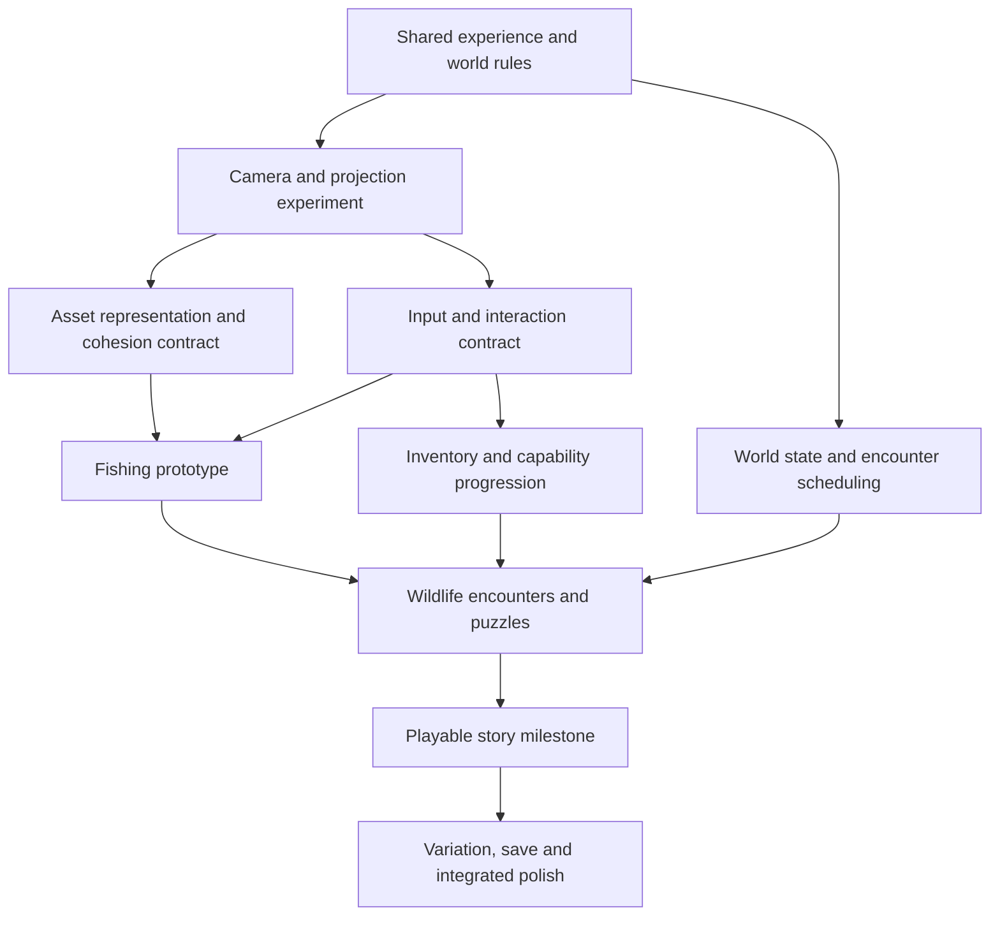

# Integrated game plan

## Latest visual and world direction

The user selected the full 12°–52° camera range and removed Keep sky. Framing is slightly smaller and the bucket browner. The next visual study must use layered illustrations, replacing the solid-looking proxies. A player-centered square-cell render grid sits inside a larger simulation grid; approaching weather drives individual panel motion. The [paper ocean and weather plan](paper_ocean_weather.md) records this update and supersedes conflicting earlier proposals below. The user approved independent sky/wind combinations, connected spring panels, authored story triggers and chance-based side opportunities. Both activation paths feed a shared event lifecycle; weather receives a random arrival direction and centers over the player. Initial weather parameters were delegated and are documented. See [event system](event_system.md) and [runtime parameters](weather_runtime_parameters.md). Do not resolve future unanswered design questions by timeout.

## Current next work

The user selected **Paper Theatre** as the clear winner of the five art studies. It is merged into main at `1622c52`. Its ocean uses independent illustrated crest cards, separate reclining ribbon cards, and an ink-colored backdrop; the old shared visible water mesh is removed. The invisible gameplay sampler remains approximate and is a later integration concern.

The authorized cohesion pass is implemented for visual review: the selected waves are unchanged and Ichigo/bucket use matching layered drawings. See [character art study](../experiments/paper_theatre_character.md). Preserve the young ungendered child, very oversized number-15 jersey, no hat, giant wooden bucket, 12–52° camera and existing physical anchors. Fish are secondary. The user now identifies the current wave artwork as turbulent wind level 2 and requests wind-driven horizontal/vertical visual motion. See [wind visual motion](wind_visual_motion.md) for the technical audit and pending frequency/travel clarification.

The alternatives are retired from active development; their committed snapshots remain historical references. See [selected study](../experiments/variant.md), [showcase review](../experiments/showcase_review.md) and [context map](context_map.md). The event/weather/salvage foundation remains implemented; full fishing, inventory and authored story remain unfinished.

## Experience

Ichigo is an open-ocean adventure built around free movement, tactile fishing, wildlife encounters, environmental puzzles, and chance-based discoveries. The player feels small, curious, and capable inside a beautiful, changing world. The desired emotional rhythm is wonder and solitude with moments of danger.

The user's Don't Starve reference is a direction for responsive systemic play, readable stylized objects, and interacting with a world of opportunities. Its specific camera, geography, and survival meters are not a specification for Ichigo.

The world allows movement in every horizontal direction. No compass heading is the correct route through the story, and no required objective sits at a fixed distant coordinate. Progress comes from observations, capabilities, actions, and changing circumstances. Local positioning still matters: getting within reach, choosing a casting spot, approaching an animal, or avoiding a hazard must have tangible consequences.

An ordinary minute might involve drifting, noticing fish under a cloud shadow, choosing a lure, casting, responding to a fish's movements, and spotting a nearby floating object. The player may instead watch, paddle away, or investigate something else. Quiet moments must be pleasant without a resource meter forcing constant activity.

## Confirmed constraints

- Ichigo is a young child with no specified gender or exact age. Use they/them. Their dad's number 15 sports jersey is very oversized; no hat. The vessel is a wooden bucket, giant relative to them.
- Keep in-game text minimal. Communicate through objects, animation, sound, behavior, relationships, and visible consequences. Brief labels and accessibility text remain available.
- No cutscenes. Important events and story conclusions happen through controllable interactions. Encounters permit observation, help, disruption, exploitation where supported, avoidance, and failure.
- Fishing must be compelling in its own right. Puzzles and discoveries drive the larger story.
- Encounters and weather vary between playthroughs. Randomness respects world conditions, continuity, and viable progression.
- The camera can tilt between a higher gameplay view and a lower sky-visible view, without reaching true overhead or a horizontal optical axis. Assets must remain coherent throughout the supported range.
- Layered illustrated paper is the next visual priority. Low-poly, medium-poly and volumetric alternatives remain later experiments, rather than a requirement before the paper study.
- Complete the initial interdependent planning in one context before splitting implementation among agents.

## Proposed baseline for the first playable slice

These are practical starting choices, open to revision through playtests.

| Decision | Initial choice | Why it connects to other systems |
|---|---|---|
| Survival pressure | Omit hunger, thirst, eating, and drinking | Fishing can focus on mastery and discovery; inventory can focus on tools and finds |
| Travel | Continuous local movement with encounter-driven progression | Every heading remains viable; local physics and positioning remain meaningful |
| Camera | Perspective first; adjustable pitch, fixed azimuth initially | Keeps a real horizon and limits the asset views needed for the first test |
| Art production | Layered illustrations first; replace rejected solid proxies | Exposes view-coverage and ocean-panel issues before producing a library |
| Progression | Knowledge + usable tool capabilities + story milestones | Loot has purpose without endless stat inflation or food replenishment |
| Failure | Recoverable setbacks in the slice | Prevents random tools, missed events, or inaccessible clues from ending progress |
| Controls | Screen-relative steering; contextual interaction mode | Stable movement across camera pitch; explicit ownership during fishing/puzzles |
| Time and weather | Shared state with gradual changes | Wildlife eligibility, fishing conditions, lighting, and sound agree |
| Engine | Godot 4 + typed GDScript; pin stable version during setup | One editor and scene architecture for the experiments and eventual game |

The omission of food/water is the proposed interpretation of the user's preference to reduce survival emphasis. Do not introduce substitute hunger-like upkeep meters without revisiting that preference.

## Interlocked gameplay loop

Notice → choose an approach → act or experiment → receive a consequence → gain understanding or a useful object → encounter new possibilities.

Fishing supplies skill expression, wildlife observation, and occasional plausible retrieval. Inventory makes discoveries physically tangible and allows equipment choices. Encounters create opportunities for both. Puzzles combine knowledge and tools into meaningful actions. Story milestones recognize those actions, then broaden future opportunities. Weather and time alter the conditions of this loop. The camera and asset system make every part understandable with little text.

Keep macro progression independent of heading. A tool may let the player retrieve an object within a nearby encounter; it must not reveal that a particular compass direction was secretly required all along. Weather can alter opportunity frequency without forcing a player to travel toward the best weather.

## How this resolves earlier proposals

- Earlier route-home navigation, survey markers, bearings, and map-coordinate milestones are retired as the default story structure. Local alignment or drift puzzles remain possible inside an encounter.
- Earlier food/water survival loops are omitted from the first slice. Fishing rewards knowledge, mastery, equipment access, and collection decisions.
- The initial camera test is bounded third-person pitch, not unrestricted orbit. Free yaw and first-person inspection are later experiments with explicit asset costs.
- Earlier adult/skiff images are environment references only. Every new character/vessel asset uses the child and bucket.
- Following the first review, prioritize illustrated paper layers. Low-/medium-poly variants remain optional later comparisons.

## Scope of the first coherent slice

Aim for a replayable 15–20 minute experience as a design target, not a schedule estimate: one child and bucket; one local ocean setup; adjustable camera; a small inventory; one usable fishing rig; two fish behavior profiles; three encounter families; one environmental puzzle with alternative solution paths; one story milestone; calm conditions plus one gentle weather transition; a short lighting-transition preview; and save/resume.

The fish profiles are behavioral prototypes until a region and species are selected. The three encounter families are a fish school, seabird activity, and floating habitat/salvage. Larger animal encounters, severe storms, extensive crafting, swimming/diving, base building, multiplayer, and a permanent navigable world map remain outside this slice.

First-person moments remain a longer-term desire. The slice can use a closer third-person inspection pose within the tested view range. If first person becomes necessary for the chosen puzzle, its character/hands and bucket interior must pass a dedicated view-coverage experiment before production.

## Shared design gates

1. **Camera and cohesion:** the scene stays attractive and readable through the supported tilt range, with useful sky visibility in normal travel.
2. **Interaction:** steering, selecting, casting, and inspecting remain coherent at both camera extremes.
3. **Fishing:** a player can learn, improve, and describe why a catch succeeded or failed without prose instruction.
4. **Progression:** finds add choices; no food upkeep or lucky mandatory drop is needed to continue.
5. **Encounter and story:** one puzzle-led milestone works through multiple opportunity paths and remains interactive.
6. **Variation:** different seeds produce different sequences; changing heading or camera does not reroll rewards or block progress.

## Decisions to resolve through experiments

| Question | Proposed default | Evidence needed |
|---|---|---|
| Camera range (resolved) | Full 12°–52°; no Keep sky mode | User selected the wider range after the demo |
| Should camera yaw be player-controlled? | Fixed azimuth in first prototype | Directional asset coverage and aim readability before enabling yaw |
| Illustrated representation | Layered drawings in spatial depth | Review individual wave panels and replacement child/bucket layers in motion |
| What does keeping fish mean without eating? | Observation/release plus optional physical specimen storage | Does keeping add an interesting decision without repetitive maintenance? |
| What is the story about? | Child-centered connection and growing understanding | Review the proposed story spine and physical motifs |
| How dangerous is the world? | Recoverable encounter failures; no default permadeath | Does tension coexist with time to observe? |
| Which ecosystem? | One coherent region/season, still unselected | Validate species and encounter behaviors together |

These questions do not block writing the shared plan or building the camera test. They do block declaring those choices final.

## Dependency overview

The [execution plan](execution_and_delegation.md) defines ownership and the point at which implementation can be delegated without fragmenting these decisions.
