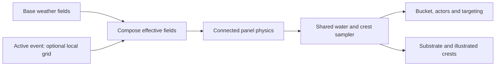

# Raised illustrated waves: correction to the visual plan

Status: required visual correction after the user reviewed the weather study. An Astra 6 High subagent independently inspected the renderer, artwork and calm/rain captures. This is a plan revision; the running demo still uses the rejected horizontal-sheet representation.

## What went wrong

[weather_presentation.gd](../../game/world/weather_presentation.gd) places a 4.55×4.75m quad at each rendered cell and rotates it 90° into the horizontal plane. Its physical tilt is limited to about 8.6°. The dark wave face, light crest and rear water are all painted on that same plane in [water_panel.svg](../../game/presentation/water_panel.svg). Spring motion moves or tips the sheet but does not give the illustrated wave a rising face.

The earlier plan correctly described overlapping drawings but left the panel's cross-section unspecified. The implementation therefore produced patterned tiles. Describing the water as calm and warning against solid terraces did not mean it should have no raised silhouette. More wind or larger spring amplitudes would not repair that representation.

## Required visual result

The water must read as layers of small raised illustrated waves: a visible dark front face, a narrow pale crest, and an upper/back shoulder. The shapes retain the faded palette, drawn contours and paper feel. Calm motion remains gentle, with no giant breaking Great Wave shape.

The equal-sided ground grid organizes simulation and ownership. It does not prescribe square visible artwork, one crest per cell, or regularly aligned rows. A panel becomes a small illustrated assembly that may contain staggered irregular crest strips crossing its footprint. Adjacent assemblies share coherent height/motion while their drawn edges may vary.

## Revised representation

1. **Continuous water substrate:** a near opaque surface follows the authoritative sampled water field. It conceals gaps between art layers and joins a cheap far-water/horizon treatment. Restore this explicitly: the current weather study hides the detailed water surface and relies on a far plane 1.4m below it.
2. **Raised crest strips:** use a thin curved or folded mesh carrying the illustration. A few rows of vertices form the rising front face, crest lip and broader rear shoulder. This provides actual spatial relief while keeping the visible material an illustration rather than a thick sculpted solid.
3. **Concealed roots:** bury strip roots into the substrate and overlap shoulders. Use opaque/depth-writing cutout regions for clear silhouettes and predictable occlusion. Do not depend on many alpha-blended sheets sorting correctly.
4. **Coherent variations:** start with three small original crest drawings/profile variants using common line weight, grain scale and palette. Stable logical-cell seeds vary spacing, shape and motif without per-frame randomness or reseeding when the grid scrolls.

Do not simply rotate all existing quads upright. An upright side drawing alone exposes thin edges at higher views and leaves the water beneath it unresolved. The curved profile and upper shoulder are part of the solution.

## Camera contract

Retain the approved fixed yaw and 12°–52° pitch range, 20° default. Author the main illustrated faces for that fixed viewing direction and anchor the geometry in world space. At low angles the face and crest silhouette carry the form; at 52° the upper shoulder and overlapping depths must remain readable.

Start without billboarding or angle-dependent stretching. Introduce bounded presentation-only compensation only after a specific failure is visible in the angle test. Do not move the physical root, interaction target, silhouette origin or fishing anchor when the camera changes. Independent free camera yaw remains a separate later feature.

## Physics and field composition

Keep these quantities explicit:

| Quantity | Meaning | Owner |
|---|---|---|
| Base/effective environment fields | Wind, currents, cloud/rain/light and wave forcing after local event modifiers | Environment composer |
| Connected panel dynamics | Root displacement/velocity and coupled response to the effective wave target | Water solver |
| Continuous water reconstruction | Surface height/normal between grid samples, including meaningful crest relief | Shared surface sampler |
| Illustrated profile | Face shape, shoulder, lip and small paper irregularities | Asset/profile representation |

The current solver has per-cell vertical springs; tilt is derived from the surface normal. It does **not** yet implement separate angular or bend springs. Add those only as a bounded extension if the new strip study needs them.

The render mesh and buoyancy/targeting must agree on meaningful raised water. A tiny paper lip can be decorative; a crest tall enough to visibly lift or occlude the bucket cannot be an unrelated renderer-only offset. The next prototype must define one shared crest profile/reconstruction sampled by both the visible surface and nearby gameplay. A coarse 4m weather cell may own a finer analytic crest shape; increasing the entire weather matrix resolution is not automatically necessary.

Do not add the same crest height once in the solver and again in rendering. Evaluate the approved profile from shared phase, local amplitude and connected panel state. Keep profile parameters independent from the weather's motion parameters, so gentle water can have a legible drawn face without increasing storm strength. Bound the allowable decorative discrepancy and verify it around the bucket and line target before approving the study.

The event-field proposal composes **before** the solver:

A departure gust or local current therefore affects the actual water and event actors as well as the drawings. Removing an event fades its modifier; it does not erase panel velocity or reset wave phase. See [encounter fields and pacing](encounter_fields_and_pacing.md).

## Controls and efficiency

Artist controls: face rise, face slope, lip width, shoulder depth, curvature, spacing, overlap and motif variation. Weather controls: wind vector, wave speed, physical amplitude and response times. Keep the two groups understandable; numerical appearance settings will be compared in a small study, not silently locked as final art.

Preserve the existing 4m square grid and nested simulation/render regions while evaluating the replacement representation. Use a small set of shared strip meshes and an atlas/material, grouped into bounded spatial MultiMesh batches. Keep stable IDs and avoid separate scripts, materials or colliding rigid bodies per crest. Expand culling bounds to contain deformation. Measure vertex updates, overdraw and frame time; the current CPU simulation measurements do not predict the new renderer's cost.

## Next implementation gate

The immediate next visual task is a **calm raised-crest study**, before additional weather polish or a larger event-art library:

1. Make one illustrated curved profile over a matching water substrate; keep the rest of the scene unchanged for comparison.
2. Verify the shared height/normal/profile around the bucket and a line target.
3. Compare three small profile/drawing variations at 12°,20°,38° and52°, plus continuous tilt.
4. Add the connected spring motion and slow travel through grid boundaries; verify stable artwork and phase.
5. Apply a gentle wind ramp and one local event modifier, checking faster motion before larger movement.
6. Review the resulting motion with the user before selecting relief/spacing and expanding the asset set.

Acceptance: dark rising faces are visible at the travel view, upper shoulders remain legible at the high view, the sea stays continuous, roots and accidental square seams are concealed, the bucket remains dry, targeting agrees with visible water, and calm water stays calm. Repetition, clipping, exposed backs, solid-looking terraces, large holes or floating decorative crests fail the gate. Passing simulation tests alone does not approve this representation.
