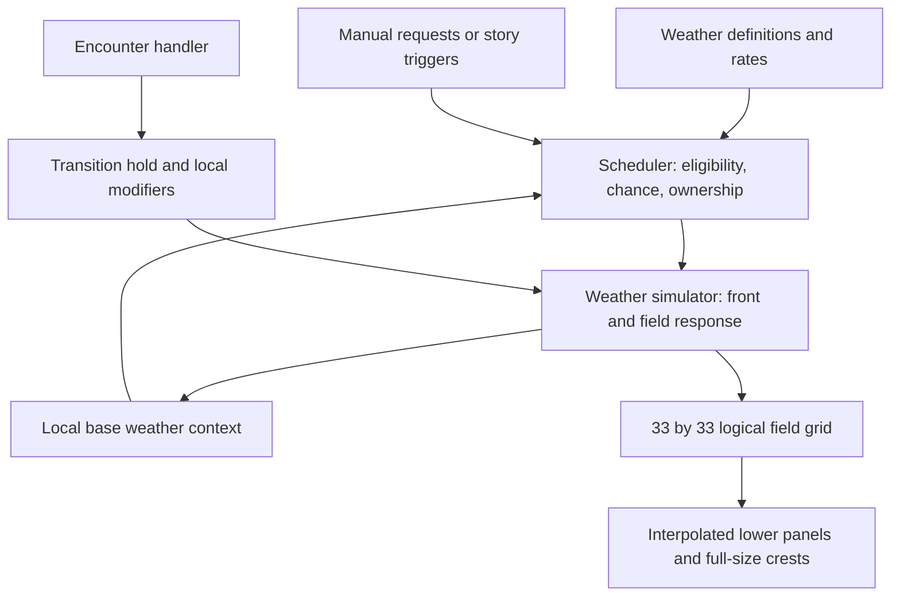

# Weather algorithm review and change modes

6 September 2026. Code review of the current Ichigo branch, including the user-requested three-mode weather setting. This describes implemented behavior, distinguishes mathematical estimates from measurements, and records proposals without selecting new weather balance.

## Fifth-tier update

The [five-level amendment](five_level_weather.md) adds Tempest on both axes: five sky and five wind levels, 25 combinations. Nine new combinations are trigger-only, so the 16-candidate automatic-weather probability analysis below remains applicable. Chance tables now have five wind rows and five sky weights, and sky mixture comes from an independent 0–4 field instead of cloud coverage. The new crest-height range is 0.35×–2× with a reversed-logarithmic curve. Keys 9/0 select Tempest sky/wind; earlier 1–8 instructions still cover the original tiers.

## Three change modes

The study HUD has a **Weather** selector. It defaults to **transitions** on launch. Changing the selector alone does not interrupt an existing front. The chosen mode is a laboratory preference, not a world-save field; an active event's actual instant/gradual execution policy is saved with the weather simulator.

| Mode | Manual 1–8 controls | Automatic weather | Existing weather / encounter locks |
| --- | --- | --- | --- |
| Transitions | Submit the selected sky/wind pair | Normal chance selection | Queue, approach, hold and clearing |
| Skip transitions | Submit the pair; instant execution when admitted | Same chances; admitted fronts execute instantly | Keep queue capacity, active hold, cooldowns and encounter locks |
| Replace now (lab) | Immediately replace weather, even while paused | Normal admission and transitions still operate | Explicit manual bypass; clear pending weather-bearing requests and cancel current weather ownership |

Keys 1–4 choose sunny/cloudy/raincloud/storm; 5–8 choose calm/breeze/strong/storm wind. Each key retains the last manually selected value of the other axis, as in the existing study. The remembered pair does not automatically track chance-selected weather. Normal and queued-skip controls respect pause; replacement explicitly works while paused.

**Skip transitions** removes approach and clearing, snaps physical field values to the established front's targets on arrival, retains `hold_s` (18 seconds by default), then snaps back to the baseline at completion. It does not shorten an already-running hold or override an active encounter. Its established spatial falloff remains; it is not uniform storm strength across the entire simulation buffer. The policy is chosen when a queued request is dispatched, so switching modes can affect requests still waiting.

**Replace now** sets the selected pair as a uniform baseline throughout the buffered grid. Cloud cover, rain, lighting attenuation, wind vector/strength, wave speed and amplitude update immediately; heights are sampled at the existing wave phase and old spring velocities are zeroed. Clock, position, day phase and wave phase are preserved. Disabling replacement restores normal request behavior but leaves the selected baseline in place; restarting the demo restores sunny/calm. This prevents an unwanted automatic fade immediately after a comparison. Automatic opportunities remain enabled, so this is not a weather-freeze setting.

A manual replacement clears waiting weather requests, including linked requests whose encounter has not started. A live encounter keeps its actor and ownership. If its paired weather is interrupted, the pair is marked cancelled so the override cannot count as story completion. Encounter-only waiting requests remain. The scheduler owns this cleanup; rendering cannot mutate queues. This bypass is a testing tool, not authored story admission.

## Reusable event policy

Future weather definitions can include:

```gdscript
"payload": {
    "sky": "storm",
    "wind": "strong",
    "instant": true,
    "hold_s": 18.0,
}
```

The scheduler validates the boolean and forwards the payload. `weather_simulation.gd` owns the snap and lifecycle. Omitting `instant` preserves gradual behavior. Explicit instant definitions remain instant in the normal mode; queued-skip mode forces instant execution for any newly admitted weather. No existing catalog definition has been changed to instant by default.

Authored instant events still obey capacity, prerequisites, cooldowns, chance weighting and linked reservation rules. Linked weather becomes established first; its encounter can start on the next scheduler step when actual local fields qualify. The simulator rejects a direct start while weather is active or held. Instant is an execution policy, not permission to interrupt gameplay.

Saved weather state includes the active `instant` flag, with older snapshots defaulting to gradual. An ephemeral field revision invalidates the water renderer's cached texture on a snap without faking elapsed time. The same fixed grid feeds dense lower panels, full-size crests and the gameplay sampler.

## Ownership and update order



`environment_runtime.gd` accumulates rendered-frame time and runs fixed **1/30-second** steps. Each step:

1. Advance the encounter handler and report completed departures.
2. Sample current base weather near the player for eligibility and weights.
3. Advance scheduler time, evaluate queued requests and accumulate chance hazards.
4. Dispatch admitted weather/encounter commands to their handlers.
5. Apply encounter-local field modifiers and the active-encounter transition hold.
6. Advance the weather simulation and report a completed weather lifecycle.

The scheduler decides **whether and when** weather may begin. The simulator decides **how quickly conditions change**. The renderer draws the resulting fields. Visual density changes none of these clocks or probabilities.

## How automatic weather is selected now

The catalog contains 16 chance-enabled combinations: four skies × four winds. Their base hazard is **1/960 per eligible second each**. All weather wind/time matrix entries and sky multipliers are **1**. Thus the machinery supports condition-dependent selection, but the current weather catalog has no preference for plausible neighboring states or time-of-day patterns. Single-axis convenience definitions are trigger-only and add no random weather rate.

A weather opportunity is blocked when weather already owns its track, an encounter is active/reserved, capacity is exhausted, chance is disabled, or a viable pending story pair is draining the tracks. Candidates must also pass hard eligibility, once-only rules if present, definition availability and busy checks. Each weather combination has a **120-second cooldown starting at completion or interrupted completion**. A newly selected front prevents a random encounter from starting in the same tick. A stable front may host a compatible encounter later.

For each eligible candidate:

```text
raw_rate_i = base_rate_i × interpolated wind/time weight × interpolated sky weight
S = sum(raw_rate_i)
scale = min(1, (1/60) / S)                 # when S > 0
hazard_i += raw_rate_i × scale × (1/30)
```

The scheduler rolls once per **one accumulated eligible second**, using `p_any = 1 - exp(-sum(hazard_i))`. On success it selects one candidate in proportion to accumulated hazard. It clears the accumulated interval after the roll. Blocked periods clear partial hazards and consume no chance RNG; they do not produce a later burst or pending backlog. Explicit triggers can queue, but chance proposals are admitted immediately or discarded.

With all 16 equally available, `S = 16/960 = 1/60`, and each candidate has 6.25% of selections. Storm sky has 25% of selections, storm wind 25%, both together 6.25%, and raincloud-or-storm sky 50%. These are conditional selection shares, not percentages of total play time. Cooldowns and future exclusions change the available pool. A sunny/calm event can also be selected while the baseline is already sunny/calm, using a weather slot with little visible change.

### Timing interpretation

These are mathematical constant-rate estimates, not a timed playthrough measurement:

| Fully eligible interval | Probability of at least one weather opportunity at the current ceiling |
| --- | --- |
| 1 second | 1.653% |
| 5 seconds | 7.996% |
| 60 seconds | 63.212% |
| 120 seconds | 86.466% |
| 180 seconds | 95.021% |

The continuous-rate mean eligible wait is 60 seconds; one-second roll quantization makes it approximately 60.5 seconds. There is no deadline or guaranteed arrival. If one combination is cooling down, the total becomes 15/960 and the mean eligible wait increases to roughly 64 seconds before roll quantization.

Normal weather adds a default **42-second lifecycle** before new weather can roll again; queued-skip mode reduces this to the **18-second hold**. Therefore skipping transitions increases weather changes per minute of wall-clock play even though it does not change the chance formula. Encounters can extend an established weather hold indefinitely until their departure completes. The separate 90-second post-encounter quiet interval blocks encounters/story pairs, not ordinary weather by itself.

The chance RNG uses the configured runtime seed (15 in the demo). Weather bearing uses a separate seed (runtime seed + 104729), and encounter behavior uses another (+7919). Identical seeds plus identical actions and timing reproduce the same sequence. Relaunching does not currently choose a fresh random seed. Encounter chance rolls share the scheduler RNG, so changed encounter eligibility can alter the subsequent weather selection sequence even with the same starting seed. Rendering frame partition is covered by deterministic runtime tests.

## How selected weather becomes visible

Normal events use a random uniform bearing, **12 seconds approach → 18 seconds hold → 12 seconds clear**. Their center is player-relative:

```text
center = player + direction × approach_distance × (1 - smoothstep(progress))
approach_distance = simulation_radius × cell_size × 1.7 = 108.8 m
influence_radius = simulation_radius × cell_size × 0.9 = 57.6 m
influence = smooth spatial falloff × lifecycle envelope
```

The rendered area is 17×17 logical cells, 68 m per side, inside a 33×33 simulated grid with 4 m cells. Each field target blends the baseline and event profile using local influence. The incoming center follows player movement and must reach them; this is deliberately not a freely advected weather system the player can outrun. Fronts return toward the baseline, rather than automatically becoming the next persistent regional climate.

| Response | Time constant | Consequence |
| --- | --- | --- |
| Wind vector/strength and shared wave phase speed | 2 s | Motion speeds up before swell grows |
| Cloud cover, rain and light attenuation | 3 s | Sky and rain follow the moving front |
| Wave amplitude | 10 s | Swell grows and decays slowly |

Each response uses `current = lerp(current, target, 1 - exp(-dt/tau))`. A front reaching hold does not mean every field is at its final value. For a fixed target, 18 seconds moves amplitude about 83.5% of the remaining gap; actual targets also vary during approach and clearing. Residual swell remains after normal weather ownership ends, and affects local chance context as it decays.

The solver integrates a shared wave phase and uses two fixed world-oriented wave components. Per-cell springs follow their targets with stiffness 12, damping 6 and neighbor coupling 1.2. Wind affects targets and speed; it does not rotate a fully simulated fluid velocity field. Wind direction changes are local blends, while wave orientation stays fixed. Cloud presentation uses local cover, a wind-driven texture offset and a procedural incoming-bank cue. This is a stylized weather/paper-spring simulation, not cloud-fluid transport.

Sky and wind are independent. The physical wind anchors 0.12 / 1.8 / 5 / 9 map to the visual/chance coordinate 0 / 1 / 2 / 3. Cloud anchors 0.12 / 0.65 / 0.88 / 1 map to the four sky states. Day phase is currently fixed at 0.25 because the day period is zero; the time-weight architecture is ready, but changing time of day is not currently driving automatic weather.

Encounter modifiers remain separate additive fields. They can alter effective wind/current/amplitude without taking over the weather track. Chance reads base scalar conditions, so a departure gust does not create a feedback loop of new weather rolls.

## Review findings and proposed next decisions

1. **Current selection is varied but memoryless.** Equal weights allow sunny/calm → storm/storm as readily as sunny/calm → cloudy/breeze. Gradual rendering softens the jump but does not create climatic continuity. Proposal: author destination-specific weights based on current conditions while preserving independent sky/wind combinations.
2. **The sea gets a baseline-centered rhythm.** Every ordinary front clears toward baseline, followed by an eligible waiting period. Proposal: review whether this calm breathing space is desirable before considering persistent weather handoffs.
3. **Repeated demo launches repeat the seed.** This helps comparisons but does not meet the eventual expectation of different new games. Proposal: separate an exposed test seed from a fresh new-game seed, while retaining deterministic saves.
4. **Some opportunities can be visually redundant.** Sunny/calm from sunny/calm still consumes the weather lifecycle. Proposal: decide whether this is useful quiet weather or should be suppressed/represented as a deliberate calm interval.
5. **No forced weather cadence exists.** Long quiet gaps remain possible; the 90-second encounter quiet rule is not a weather guarantee. Proposal: collect a timeline in real play before changing rates or adding a maximum wait.
6. **Event holds affect weather duration.** This honors the accepted lock rule; physical animation and local modifiers continue. Very long encounters can produce very long weather holds.
7. **Instant testing changes the baseline and bypasses ownership intentionally.** It is useful for visual comparisons, but play-balance evaluation should use transitions with a fresh launch. Queued-skip mode is useful for exercising event sequencing without bypassing locks.

No probability, profile, seed policy or automatic-transition adjacency weight was changed by this task. The next design decisions remain with the user after reviewing this behavior.

## Code references and verification

Primary implementation: [runtime](../../game/events/environment_runtime.gd), [scheduler](../../game/events/environment_scheduler.gd), [chance evaluation](../../game/events/event_chance.gd), [catalog](../../game/events/event_catalog.gd), [weather simulation](../../game/world/weather_simulation.gd), [study controls](../../game/camera_study.gd), [renderer field cache](../../game/world/illustrated_water_surface.gd).

Targeted mode tests cover queued versus immediate behavior, capacity, encounter blocking, linked-weather interruption, instant entry/hold/exit, phase preservation, validation and restore. Rendered scene checks cover all three selector values, paused replacement, immediate GPU wind/sky updates and rain on/off. Regression suites cover existing scheduler/chance, weather simulation and runtime replay. Validation completed: 46 targeted weather-mode checks, 12 rendered selector/paused-update checks, 108 scheduler/chance checks, 29 runtime integration/replay checks, 128 weather simulation checks, and 90 rendered density checks — **513 passing checks**. The rendered paused calm/storm captures were inspected for mode-control readability and immediate visual response. Probability/timing estimates in this review are analytical; this task did not measure a long automatic-weather playthrough.
