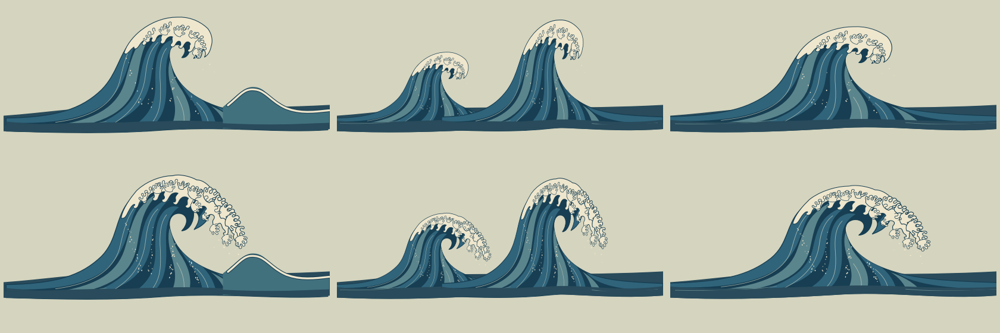

# Growing storm crest artwork

6 September 2026. **Reverted by user after the demo; historical experiment only.** The renderer again uses Quiet Cut and the thick-black storm family. The finer lower sea and separate multi-source turbulence were retained. This is the art component of the [storm breaker experiment](storm_breakers.md), following the user's request for increasingly Hokusai-like waves as their height increases. The user's supplied wave crop guides the ivory branching foam, hooked leading fingers and rising indigo water ribbons. This request supersedes the preceding solid-black storm crown experiment; these sources do not change the retained ordinary Quiet Cut family.

The renderer owns the height thresholds and source selection. The art itself has two additional stages:

| Stage | Drawing |
| --- | --- |
| Building | A smaller ivory curl, a few opening foam fingers, restrained spray and distinct engraved water columns. |
| Towering | A wider overhanging foam canopy with large branching claws, smaller hooked inner eddies, a more open breaking mouth and additional pale spray climbing the indigo columns. |

Curl, double and sweep retain distinct compositions: one dominant curl and a small returning swell; two differently sized crests; and a broader, lower sweep. All six sources preserve the shallow Quiet Cut root at roughly source y=310, the existing 800×400 viewBox and 1200×600 nominal source dimensions. The body intentionally remains quiet near the hem. Ink is dark indigo, foam warm ivory, and the body uses the established muted blue/teal water palette. Sources use ordinary editable SVG paths; no embedded bitmap, filter or external font is required.

## Source and import contract

Sources are `game/presentation/waves/storm_growth/{building,towering}/theatre_{curl,double,sweep}.svg`. `crest_atlas.svg` contains the same vectors in a 2400×800 source: three 800×400 cells across, two down. The top row is building and the bottom row towering; columns are curl, double, sweep. Each atlas cell is clipped locally with at least eight source units of horizontal transparent margin. Individual sources have equivalent clipping. The source dimensions and root coordinates preserve the existing card pivots and normalized UV convention.

This is original, editable vector artwork interpreting the user-supplied reference crop. The older storm sources and ordinary Quiet Cut assets remain available for comparison. No gameplay collision or wave simulation changes belong to this artwork package.

## Verification

All seven SVG sources parse, have unique internal IDs and resolve their clip references. A standalone Godot 4.7.2 SVG raster pass loaded the atlas successfully. The [two-stage contact sheet](storm-growth/art-atlas.png) was inspected for readable silhouettes, progressive branching foam, consistent roots and separated atlas cells. This is source-art verification; shader selection, scene readability, motion and the full camera range are verified by the owning runtime change. User visual approval is still pending.

